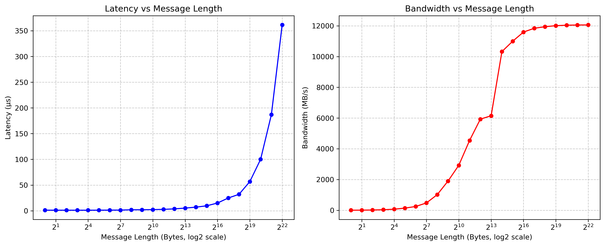
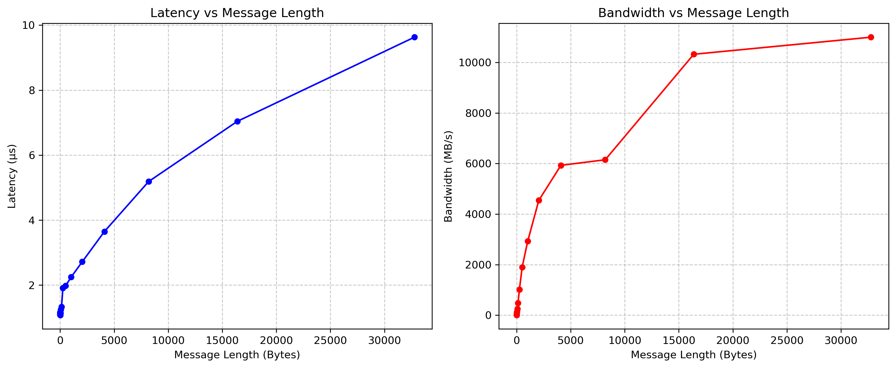
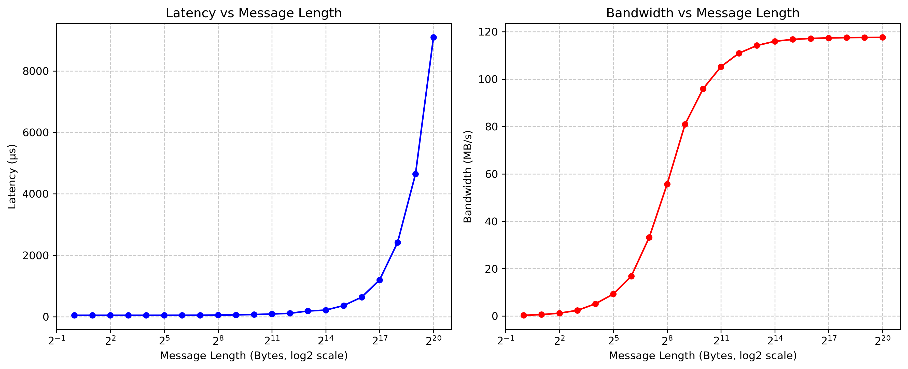
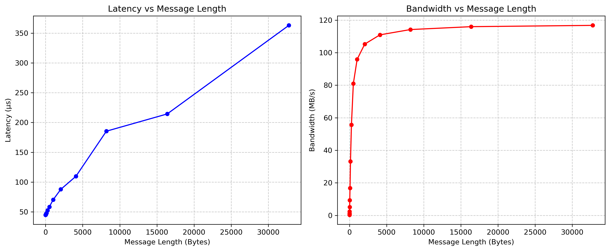

HW1

颜子俊 计35 2023010828

## 任务一：网络带宽和延迟测试

### Infiniband

| 编号 | 消息长度 | 延迟 (us) | 带宽 (MB/s) |
|------|----------|-----------|-------------|
| 1    | 1        | 1.16      | 4.31        |
| 2    | 2        | 1.11      | 8.44        |
| 3    | 4        | 1.09      | 17.56       |
| 4    | 8        | 1.08      | 34.98       |
| 5    | 16       | 1.08      | 69.95       |
| 6    | 32       | 1.14      | 140.90      |
| 7    | 64       | 1.25      | 245.70      |
| 8    | 128      | 1.33      | 478.29      |
| 9    | 256      | 1.91      | 1016.90     |
| 10   | 512      | 1.98      | 1900.09     |
| 11   | 1024     | 2.25      | 2926.51     |
| 12   | 2048     | 2.72      | 4542.62     |
| 13   | 4096     | 3.65      | 5929.24     |
| 14   | 8192     | 5.19      | 6149.52     |
| 15   | 16384    | 7.04      | 10325.16    |
| 16   | 32768    | 9.63      | 10999.94    |
| 17   | 65536    | 15.03     | 11593.71    |
| 18   | 131072   | 24.82     | 11842.04    |
| 19   | 262144   | 32.01     | 11943.14    |
| 20   | 524288   | 56.73     | 12010.84    |
| 21   | 1048576  | 99.99     | 12041.30    |
| 22   | 2097152  | 186.84    | 12054.20    |
| 23   | 4194304  | 361.40    | 12058.70    |

### 以太网络

| 编号 | 消息长度 | 延迟 (us) | 带宽 (MB/s) |
|------|----------|-----------|-------------|
| 1    | 1        | 44.84     | 0.31        |
| 2    | 2        | 45.02     | 0.61        |
| 3    | 4        | 44.95     | 1.22        |
| 4    | 8        | 45.10     | 2.40        |
| 5    | 16       | 45.17     | 5.14        |
| 6    | 32       | 45.42     | 9.28        |
| 7    | 64       | 46.38     | 16.79       |
| 8    | 128      | 47.88     | 33.16       |
| 9    | 256      | 52.63     | 55.66       |
| 10   | 512      | 58.38     | 80.94       |
| 11   | 1024     | 70.30     | 95.89       |
| 12   | 2048     | 87.70     | 105.26      |
| 13   | 4096     | 109.73    | 110.94      |
| 14   | 8192     | 185.40    | 114.19      |
| 15   | 16384    | 214.37    | 115.97      |
| 16   | 32768    | 363.11    | 116.76      |
| 17   | 65536    | 635.63    | 117.18      |
| 18   | 131072   | 1198.37   | 117.39      |
| 19   | 262144   | 2414.01   | 117.52      |
| 20   | 524288   | 4643.61   | 117.57      |
| 21   | 1048576  | 9089.78   | 117.61      |

- 当消息长度增加时，延迟和带宽均增长。延迟大致与消息长度成正比，对数刻度下呈现“J”形；带宽增速逐渐变慢，最后趋于饱和，对数刻度下呈现“S”形。
- Infiniband 带宽增长较快，以太网络延迟增长较快。以太网络带宽更快达到饱和。
- 延迟主要由传输时间决定，消息长度越长，传输时间越长，延迟越大，大致成正比。带宽在小长度信息范围内也大致与消息长度成正比，当消息长度过长时，物理带宽利用率接近极限，由于硬件的限制，带宽逐渐趋于饱和。
- Infiniband 整体上延迟相较于以太网络低两个数量级，而带宽比以太网络高两个数量级。

## 任务二：阻塞与非阻塞的对比

| 编号 | 消息长度   | 计算量 (ms) | mpi_sync 总耗时 (ms) | mpi_async 总耗时 (ms) |
|------|------------|-------------|----------------------|-----------------------|
| 1    | 100000000  | 10          | 939.622              | 669.156               |
| 2    | 100000000  | 20          | 1050.3               | 700.21                |
| 3    | 100000000  | 40          | 1102.62              | 852.03                |
| 4    | 100000000  | 80          | 1646.79              | 845.816               |
| 5    | 100000000  | 160         | 2449.71              | 1600.52               |

- 当计算时间大于等于通信时间时，非阻塞通信程序能完美掩盖通信时间。
- 相比于 `mpi_sync.cpp`，在每轮迭代中，`mpi_async.cpp` 在启动 `MPI_Isend` 后并没有等待传输完成，而是立即返回进行计算。在所有迭代完成后再使用句柄等待传输完成。